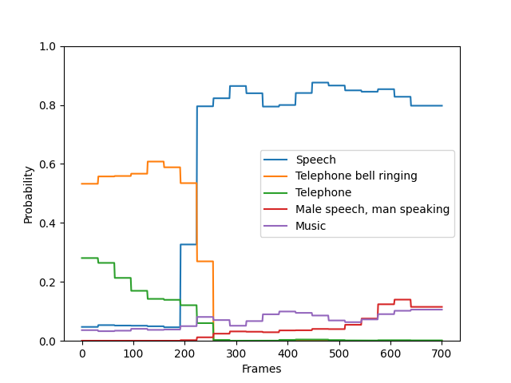

# PANNs inferece

**panns_inference** provides an easy to use Python interface for audio tagging and sound event detection. The audio tagging and sound event detection models are trained from PANNs: Large-Scale Pretrained Audio Neural Networks for Audio Pattern Recognition: https://github.com/qiuqiangkong/audioset_tagging_cnn

## Installation
PyTorch>=1.0 is required.
```
$ pip install panns-inference
```

## Usage
```
$ python3 example.py
```

For example:

```
import librosa
import panns_inference
from panns_inference import AudioTagging, SoundEventDetection, labels

audio_path = 'examples/R9_ZSCveAHg_7s.wav'
(audio, _) = librosa.core.load(audio_path, sr=32000, mono=True)
audio = audio[None, :]  # (batch_size, segment_samples)

print('------ Audio tagging ------')
at = AudioTagging(device='cuda')
(clipwise_output, embedding) = at.inference(audio)

print('------ Sound event detection ------')
sed = SoundEventDetection(device='cuda')
framewise_output = sed.inference(audio)
```


## Results
<pre>
------ Audio tagging ------
Checkpoint path: /root/panns_data/Cnn14_mAP=0.431.pth
GPU number: 1
Speech: 0.893
Telephone bell ringing: 0.754
Inside, small room: 0.235
Telephone: 0.183
Music: 0.092
Ringtone: 0.047
Inside, large room or hall: 0.028
Alarm: 0.014
Animal: 0.009
Vehicle: 0.008
------ Sound event detection ------
Checkpoint path: /root/panns_data/Cnn14_mAP=0.431.pth
GPU number: 1
Save fig to appendixes/sed_result.pdf
</pre>

Sound event detection plot:


## Cite
[1] Kong, Qiuqiang, Yin Cao, Turab Iqbal, Yuxuan Wang, Wenwu Wang, and Mark D. Plumbley. "PANNs: Large-Scale Pretrained Audio Neural Networks for Audio Pattern Recognition." arXiv preprint arXiv:1912.10211 (2019).